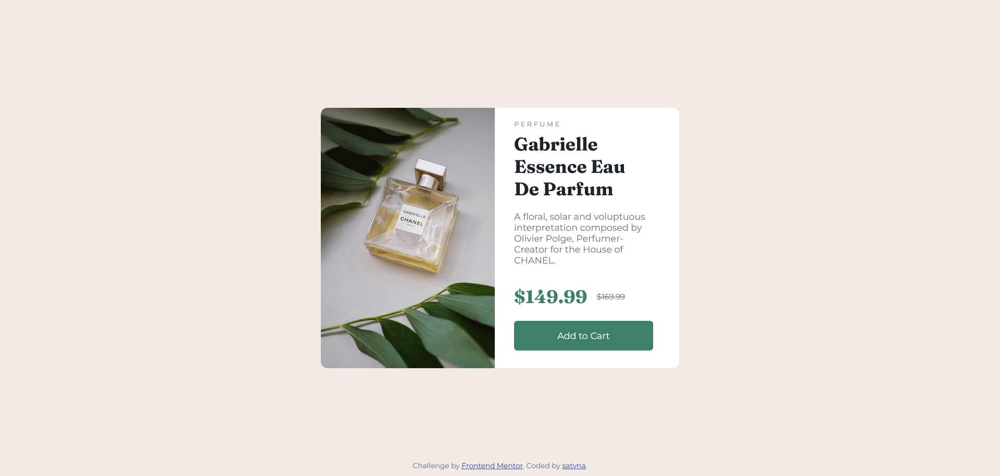

# Frontend Mentor - Product preview card component solution

This is a solution to the [Product preview card component challenge on Frontend Mentor](https://www.frontendmentor.io/challenges/product-preview-card-component-GO7UmttRfa). Frontend Mentor challenges help you improve your coding skills by building realistic projects.

## Table of contents

- [Frontend Mentor - Product preview card component solution](#frontend-mentor---product-preview-card-component-solution)
  - [Table of contents](#table-of-contents)
    - [The challenge](#the-challenge)
    - [Screenshot](#screenshot)
    - [Links](#links)
  - [My process](#my-process)
    - [Built with](#built-with)
    - [What I learned](#what-i-learned)
    - [Useful resources](#useful-resources)
  - [Author](#author)

**Note: Delete this note and update the table of contents based on what sections you keep.**
### The challenge

Users should be able to:

- View the optimal layout depending on their device's screen size
- See hover and focus states for interactive elements

### Screenshot

### Links

- Live Site URL: [Add live site URL here](https://satvna.github.io/frontendmentor-product-preview-card/)

## My process
- Separated text into divs for structure
- Separated image and info into two different halves
- Styled with flex and grid
- Developed mobile view with media queries by changing flex-direction, height, and width
### Built with

- HTML5
- CSS custom properties
- Flexbox
- CSS Grid
- Mobile-second workflow (my bad)

### What I learned
- Not to be afraid of media queries
- Setting html and body to 100% width/height allows you to take up the entire viewport
- There is an onclick property for divs
- Margins are a good way to move elements up & down, while still in flex or grid containers

### Useful resources

- [A Complete Guide to Flexbox](https://css-tricks.com/snippets/css/a-guide-to-flexbox/) - Flexbox tricks.
- [A Complete Guide to CSS Grid](https://css-tricks.com/snippets/css/complete-guide-grid/) - CSS Grid tricks.

## Author

- Website - [satvna](https://github.com/satvna)
- Frontend Mentor - [@yourusername](https://www.frontendmentor.io/profile/yourusername)
